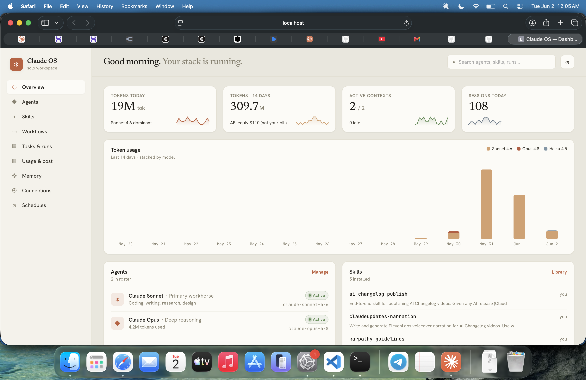

# Claude OS

> A self-hosted dashboard for your [Claude Code](https://claude.ai/code) workspace.

[](LICENSE)
[](https://github.com/cybrking/claude-os/actions/workflows/ci.yml)
[](https://nodejs.org)



---

## Features

- **Real token usage** — parsed from your JSONL transcripts, broken down by model (Sonnet, Opus, Haiku) and day over the last 14 days
- **Subscription-aware** — shows token volume as the headline; API-equivalent dollar value is displayed as a secondary reference only, clearly labeled "not your bill"
- **Skills catalog** — every skill in `~/.claude/skills/` with name and description; no fake invocation stats
- **Workflows list** — scripts from `~/.claude/workflows/` with chain step visualization
- **MCP connections** — every connected MCP server from `mcp-needs-auth-cache.json`
- **Memory viewer** — entries from your file-based memory store with descriptions
- **9 views** — Overview · Agents · Skills · Workflows · Tasks · Usage · Memory · Connections · Schedules
- **Auto-refresh** — data reloads every 30 seconds; no rebuild needed

---

## Quick Start

```bash
git clone https://github.com/cybrking/claude-os
cd claude-os
npm install
npm run build
npm start
```

Open **http://localhost:3001** — the dashboard reads your `~/.claude/` workspace automatically.

### Requirements

- **Node.js 20+** — [download](https://nodejs.org)
- **Claude Code** — `~/.claude/` must exist ([get Claude Code](https://claude.ai/code))

---

## How It Works

Claude OS reads your local `~/.claude/` directory on every API request (60-second server cache) and serves it to a React frontend that polls every 30 seconds.

```
~/.claude/
  projects/*/**.jsonl      →  token usage by model + day, session history
  skills/*/SKILL.md        →  installed skills + descriptions
  workflows/*.js           →  workflow scripts + chain steps
  mcp-needs-auth-cache     →  MCP server list + auth status
  projects/*/memory/       →  memory entries
```

No external API calls. No accounts. No data leaves your machine.

---

## Configuration

| Variable | Default | Description |
|----------|---------|-------------|
| `PORT` | `3001` | Port the server listens on |
| `NODE_ENV` | — | Set to `production` for production mode |
| `CLAUDE_DIR` | `~/.claude` | Path to your Claude Code directory |

```bash
PORT=8080 npm start
CLAUDE_DIR=/Volumes/external/.claude npm start
```

---

## Development

```bash
npm run dev
```

Starts two processes via `concurrently`:
- **Vite** — React dev server with hot reload at `http://localhost:5173`
- **Express** — API server at `http://localhost:3001`

Open `http://localhost:5173` in dev mode (Vite proxies `/api/*` calls to `:3001` automatically).

### Project Structure

```
claude-os/
├── server/
│   └── index.js          # Express API — reads ~/.claude/, serves dist/ in production
├── src/
│   ├── App.jsx            # Root component, routing, error boundary
│   ├── index.css          # Design system (CSS custom properties, all component styles)
│   ├── hooks/
│   │   └── useData.js     # Polls /api/* every 30s with retry + stale-while-revalidate
│   ├── components/
│   │   ├── ui.jsx         # Primitives: Card, Dot, Pill, Sparkline, StackedBars, etc.
│   │   └── Overview.jsx   # Overview page + shared row components
│   └── views/             # One file per nav section (8 views)
├── docs/
│   └── screenshots/       # README screenshots
├── public/
│   └── favicon.svg        # Clay ✻ icon
├── .github/
│   └── workflows/ci.yml   # Build verification on Node 20 + 22
├── CLAUDE.md              # Setup instructions for Claude Code users
└── package.json
```

### Scripts

| Command | Description |
|---------|-------------|
| `npm run dev` | Start Vite + Express concurrently (hot reload) |
| `npm run build` | Production build → `dist/` |
| `npm start` | Serve `dist/` + API on port 3001 |

---

## Security & Privacy

- **Local only** — reads exclusively from your machine's `~/.claude/` directory
- **No external calls** — zero network requests beyond Google Fonts (CSS only)
- **Localhost CORS** — API only accepts requests from `localhost` origins
- **Security headers** — `helmet` middleware applied to all responses
- **Read-only** — no write access to your `~/.claude/` data

---

## Troubleshooting

**Port 3001 is already in use**
```bash
PORT=3002 npm start
```

**Dashboard shows no data / blank views**

Run the build step before starting:
```bash
npm run build && npm start
```

**`~/.claude/` not found**
```bash
CLAUDE_DIR=/path/to/your/.claude npm start
```

**Skills or workflows not showing**

- Skills: `~/.claude/skills/<name>/SKILL.md` must exist
- Workflows: `.js` files must be in `~/.claude/workflows/`
- Data refreshes every 60s server-side; restart after adding new items

**Token usage shows zeros**

The server parses `~/.claude/projects/` JSONL transcripts. If you've recently started using Claude Code, data accumulates over time.

---

## Contributing

Open an issue before submitting a large PR. For bugs, include your Node version (`node --version`) and any console errors.

1. Fork the repo
2. Create a branch: `git checkout -b feat/your-feature`
3. Run `npm run build` to verify
4. Open a pull request against `main`

---

## License

[MIT](LICENSE) — © 2026 Travis Felder
